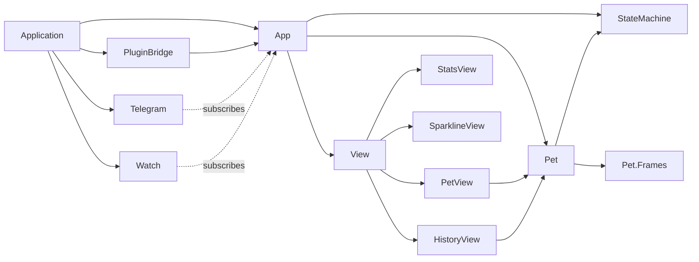
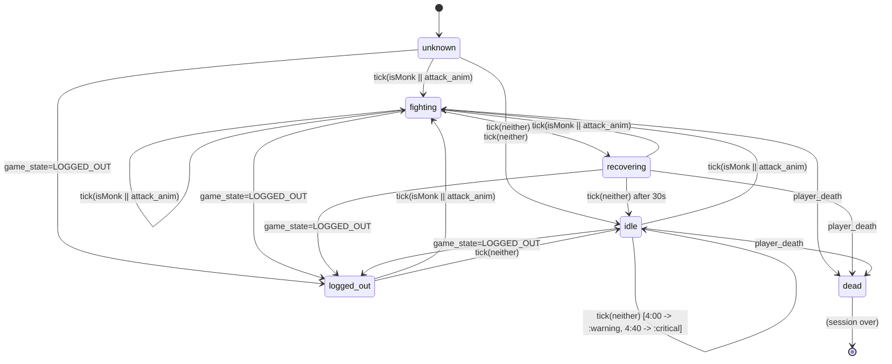
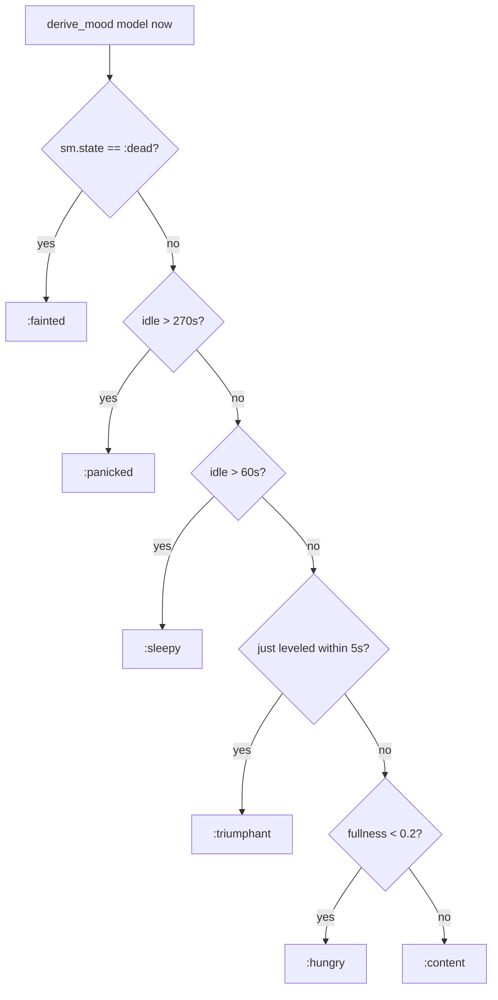

# Architecture — raxol_monkwatcher

Status: **proposed**, pre-implementation. The spec is `raxol_monkwatcher.md` at the repo root. This document validates the proposed structure, scores its dependencies, names its patterns and risks, and links to ADRs for load-bearing decisions.

## 1. Module topology

### Process-bearing modules (supervised)

| Module                                | Kind                | Role                                                     |
|---------------------------------------|---------------------|----------------------------------------------------------|
| `Raxol.Monkwatcher.Application`       | OTP application     | Boot, supervisor                                         |
| `Raxol.Monkwatcher.PubSub`            | `Phoenix.PubSub`    | App -> Surfaces fan-out on topic `"alerts"`              |
| `Raxol.Monkwatcher.App`               | TEA runtime         | Owns model, runs `update/2`, emits commands              |
| `Raxol.Monkwatcher.PluginBridge`      | `GenServer` (UDS)   | Consumes RuneLite JSON, dispatches to App                |
| `Raxol.Monkwatcher.Surfaces.Telegram` | `GenServer` (opt)   | Subscribes to `"alerts"`, edits a pinned message         |
| `Raxol.Monkwatcher.Surfaces.Watch`    | `GenServer` (opt)   | Subscribes to `"alerts"`, pushes APNS via `raxol_watch`  |

### Pure modules (no state, no processes)

| Module                                  | Role                                                   |
|-----------------------------------------|--------------------------------------------------------|
| `Raxol.Monkwatcher.StateMachine`        | Pure FSM over plugin ticks. Threshold detection.       |
| `Raxol.Monkwatcher.Pet`                 | Mood/fullness/energy derivation from model.            |
| `Raxol.Monkwatcher.Pet.Frames`          | ASCII art data (8 frames × 6 moods).                   |
| `Raxol.Monkwatcher.View`                | Render dispatcher (pet/history/stats/sparkline).       |
| `Raxol.Monkwatcher.View.PetView` et al. | Per-view render functions.                             |

### Supervision tree

```mermaid
graph TD
  S[Supervisor :one_for_one]
  S --> PS[Phoenix.PubSub]
  S --> A[App]
  S --> PB[PluginBridge]
  S --> T[Surfaces.Telegram?]
  S --> W[Surfaces.Watch?]
  PS -.subscribed by.-> T
  PS -.subscribed by.-> W
  PB -. App.dispatch/1 .-> A
  A -. broadcasts on alerts .-> PS
```

Start order matters: PubSub before App before surfaces (surfaces subscribe in `init/1`). PluginBridge can start any time (reconnect loop). The spec gets this right.

A crash of `App` loses the model — fresh pet, fresh name. This is consistent with the "no persistence" stance (ADR-0005) but should be a conscious choice rather than accidental.

## 2. Dependency inventory and coupling scores

Coupling scored on three axes (1-5 each) per the architect skill rubric: **F**requency × **B**readth × **R**eplaceability. Score 3-6 low, 7-10 medium, 11-15 high.

| Dependency                            | Type                | F | B | R | Score | Notes                                                                 |
|---------------------------------------|---------------------|---|---|---|-------|-----------------------------------------------------------------------|
| `raxol` (Core, View, BaseManager)     | in-process          | 5 | 5 | 5 | **15** | Framework, by design. Drives App, View, PluginBridge.                |
| RuneLite UDS protocol                 | local-subprocess    | 5 | 1 | 5 | **11** | Wire format change = both sides rewritten. Mitigation: protocol version field. |
| `phoenix_pubsub`                      | in-process          | 5 | 3 | 2 | **10** | App↔Surfaces seam. Swappable for `Registry` + broadcast if needed.    |
| `jason`                               | in-process          | 5 | 1 | 1 | **7**  | One call site in `PluginBridge`. Trivially swappable.                 |
| `raxol_telegram` + `telegex`          | in-process + external | 1 | 1 | 4 | **6**  | Localized to one surface. Telegram Bot API as true-external.          |
| `raxol_watch` (APNS)                  | in-process + external | 1 | 1 | 4 | **6**  | Localized to one surface.                                             |
| `stream_data`                         | in-process test     | - | - | - | -      | Test-only.                                                            |
| `phoenix.pubsub` topic `"alerts"`     | internal (string)   | 5 | 4 | 3 | **12** | Stringly-typed channel name used by 3 modules. Worth a `@topic "alerts"` constant in a shared module. |

### Cycle check

No circular module dependencies in the proposed graph:



`Pet -> StateMachine` (for `time_in_state_ms`) and `App -> {StateMachine, Pet}` are the only domain edges. Clean.

## 3. Pattern identification

**Primary pattern: TEA (The Elm Architecture) inside OTP, with a hexagonal pure core.**

- **TEA layer**: `App` holds the single model. `update/2` is pure (over its branches). Effects are returned as commands the Raxol runtime executes asynchronously.
- **Hexagonal core**: `StateMachine` and `Pet` are pure, framework-free, property-testable. All side-effecting adapters (`PluginBridge`, `Surfaces.*`) sit at the edges.
- **Event-driven seam**: `Phoenix.PubSub` decouples App from surfaces. Surfaces are conditionally started — adding a new surface (e.g., a Discord one) means one new GenServer + one new supervisor child, zero changes to App.

This is a sound choice for the problem shape: one source of truth, multiple synchronized projections, pluggable I/O. No reason to deviate.

## 4. Risks and anti-pattern findings

Ranked by severity. Each item lists the smell, the spec evidence, and a concrete mitigation.

### R1. `App` is a god-module candidate — HIGH

The spec's `App` module owns: model schema, dispatch routing, StateMachine threading, Pet mood derivation, command construction, view scheduling, scroll-wheel handling with view-cycle threshold logic, milestone detection, notification muting, random pet-name selection. The `update/2` already has 6 message variants and will grow. The file as drafted is ~150 lines and isn't done.

**Mitigation**: extract `Raxol.Monkwatcher.App.Updaters` (pure, `update_plugin_tick/2`, `update_kill/2`, `update_scroll/2`, etc.) leaving `App.update/2` as a thin dispatch shell. Keep `init/1`, the dispatch helper, and command construction in `App`.

### R2. View impurity — HIGH

`PetView.render/1` calls `System.system_time(:millisecond)` directly, and `header/1` calls it independently. Two reads of the wall clock in one render means displayed values can disagree by a millisecond. More importantly, views become non-deterministic and untestable as pure functions.

**Mitigation**: `App.view/1` reads `now` once (from the latest tick's `payload["t"]`, falling back to `System.monotonic_time`), threads it into `View.render(model, now)`. All view modules take `now` as a second arg.

### R3. `File.read!` inside `init/0` — MEDIUM

`random_monk_name/0` reads `priv/monk_names.txt` from CWD on every App init. Breaks under `mix release` (CWD is not the project root) and re-reads on every supervisor restart.

**Mitigation**: load once at Application boot via `Application.app_dir(:raxol_monkwatcher, "priv/monk_names.txt")`, cache in `:persistent_term` keyed by `{__MODULE__, :monk_names}`. App calls `Enum.random(:persistent_term.get(...))`.

### R4. Coupling to `Raxol.Core.Behaviours.BaseManager` — MEDIUM

`PluginBridge` uses a Raxol-internal behaviour (`init_manager`, `handle_manager_info`). If Raxol changes the callback shape between versions, this module breaks invisibly until runtime.

**Mitigation**: write `PluginBridge` as a plain `GenServer`. It's a 50-line module; the behaviour buys little and adds version coupling.

### R5. Mood derivation runs on every event — LOW

`Pet.derive_mood/2` is called on every plugin tick *and* every `monk_killed` event. At one tick per ~600ms plus rapid kills, that's >2 calls/sec. The function is pure and cheap, but the spec promises "5-10 tick mood smoothing" that no code enforces.

**Mitigation**: store the *target* mood in the model and only animate the transition over N ticks. `Pet.tick_mood(model, now)` returns the displayed mood; `Pet.derive_target_mood/2` returns where it's heading. View renders displayed mood.

### R6. `@attack_animations` is hardcoded — LOW

Spec admits "extend as discovered". Hardcoding it means every tuning iteration during real-play replay needs a recompile.

**Mitigation**: `Application.get_env(:raxol_monkwatcher, :attack_animations, @default_attack_animations)`, override in `config/runtime.exs` or via an env var.

### R7. Fire-and-forget `GenServer.cast` for dispatch — LOW

`App.dispatch/1` is `GenServer.cast`. At ~600ms tick cadence the mailbox stays shallow, but a slow PubSub broadcast inside `App.update` would queue ticks. Commands are already wrapped in `{:async, fn -> ... end}` — verify the Raxol runtime executes them in a separate task, otherwise broadcasts block the App process.

**Mitigation**: confirm Raxol async command semantics. If commands run inline, switch `Phoenix.PubSub.broadcast/3` to `broadcast_from!/4` or move it behind a Task.

### R8. Shallow `View` dispatcher — INFO

`View.render/1` likely just `case`-dispatches to one of four view modules. Shallow but fine — don't grow logic in it; if rendering needs policy, deepen one level down.

### R9. Stringly-typed PubSub topic — INFO

`"alerts"` appears literally in `App`, `Surfaces.Telegram`, `Surfaces.Watch`. One typo = silent drop.

**Mitigation**: `@alerts_topic "alerts"` in a `Raxol.Monkwatcher.Channels` module, or a function `alerts_topic/0`.

### R10. Global `raxol_watch` action dispatcher registration — INFO

`config :raxol_watch, action_dispatcher: Raxol.Monkwatcher.App` is global. Two Raxol apps in one node clash. Not a concern today but worth a comment.

## 5. Data-flow diagram


## 6. StateMachine FSM



Notification thresholds only fire while `state == :idle` and `state_since_ms` is set. Any combat tick resets `sm.notified` so a fresh idle window re-fires.

## 7. Pet mood derivation



Order is significant: `:fainted` wins over everything, `:panicked` over `:sleepy`, `:triumphant` over `:hungry`. The spec encodes this implicitly via `cond` ordering; codifying it in tests prevents accidental reordering.

## 8. ADR index

| ADR                                                                       | Title                                                                   | Status   |
|---------------------------------------------------------------------------|-------------------------------------------------------------------------|----------|
| [0001](adr/0001-adopt-tea-single-model.md)                                | Adopt TEA single-model architecture for the app core                    | Proposed |
| [0002](adr/0002-uds-newline-json-bridge.md)                               | Use Unix Domain Socket with newline-delimited JSON for RuneLite bridge  | Proposed |
| [0003](adr/0003-pure-state-machine.md)                                    | Implement StateMachine as a pure module, not `gen_statem`               | Proposed |
| [0004](adr/0004-pubsub-app-to-surfaces.md)                                | Use Phoenix.PubSub as the App-to-Surfaces seam                          | Proposed |
| [0005](adr/0005-no-persistence.md)                                        | Do not persist session state across crashes or restarts                 | Proposed |
| [0006](adr/0006-conditional-supervisor-surfaces.md)                       | Fan out surfaces via conditional supervisor children, not a registry    | Proposed |

## 9. Recommendations, ranked by impact

1. **Before writing `App`, extract `App.Updaters`** (R1). Cheap now, expensive later.
2. **Thread `now` through `view/1`** (R2). Sets the discipline before the views are written.
3. **Load `monk_names` once at boot into `:persistent_term`** (R3). One-line fix; prevents a release-time surprise.
4. **Move `@attack_animations` to runtime config** (R6). Enables the replay-tuning loop the spec depends on.
5. **Use a plain `GenServer` for `PluginBridge`** (R4). Decouples from a Raxol-internal behaviour.
6. **Add `Channels` module with `alerts_topic/0`** (R9). Prevents typo-induced silent drops across three modules.
7. **Codify pet-mood ordering as an ExUnit test** (§7). Prevents accidental `cond` reordering from changing user-visible behavior.

None of these block starting the build order in the spec. Items 1, 2, and 3 should be in place by the time `App` is written (step 5 of the build order). Items 4, 5, 6 by the time the surfaces are wired (steps 6-8).
