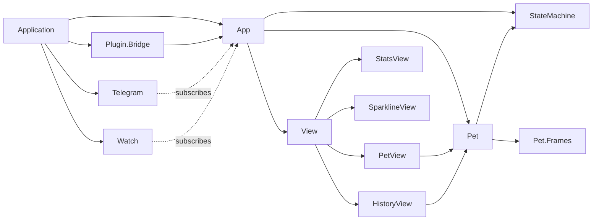
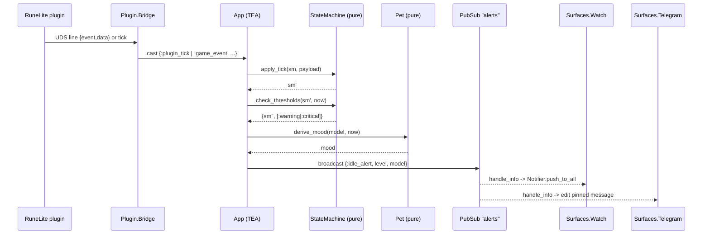
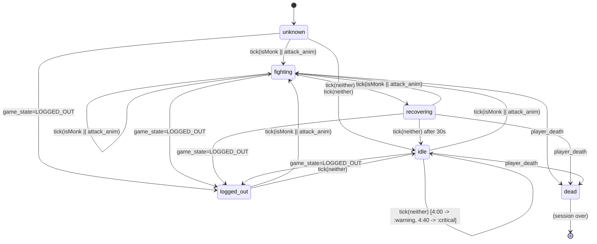
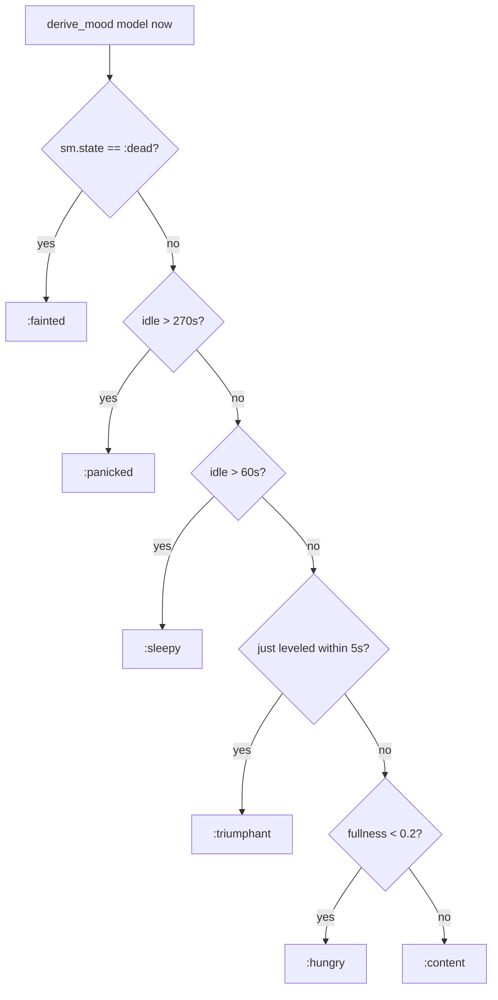

# Architecture — raxol_monkwatcher

Status: **implemented**. The original design spec (`raxol_monkwatcher.md`) was deleted once the build landed; this document is now the source-of-truth for the module topology, dependency graph, and risk register. Load-bearing decisions live in `adr/`.

Two structural drifts from the original spec to flag for readers: there is no terminal surface (only `Surfaces.Watch` and `Surfaces.Telegram`), and `App` is a plain `GenServer` calling pure `App.Updaters.*` functions — not a Raxol TEA runtime. `raxol` is not a dependency.

## 1. Module topology

### Process-bearing modules (supervised)

| Module                                | Kind                | Role                                                                      |
|---------------------------------------|---------------------|---------------------------------------------------------------------------|
| `Raxol.Monkwatcher.Application`       | OTP application     | Boot, supervisor                                                          |
| `Raxol.Monkwatcher.PubSub`            | `Phoenix.PubSub`    | App -> Surfaces fan-out on topic `Channels.alerts()`                      |
| `Raxol.Monkwatcher.App`               | `GenServer`         | Owns model, routes inbound by shape to `App.Updaters.*`, executes commands |
| `Raxol.Monkwatcher.Plugin.Bridge`     | `GenServer` (UDS)   | Consumes RuneLite JSON, decodes via `Plugin.Codec`, dispatches to App     |
| `Raxol.Monkwatcher.Surfaces.Telegram` | `GenServer` (opt)   | Subscribes to alerts, formats pinned-message text (no Telegex wiring yet) |
| `Raxol.Monkwatcher.Surfaces.Watch`    | `GenServer` (opt)   | Subscribes to alerts, builds push notifications (no APNS adapter yet)     |

### Pure modules (no state, no processes)

| Module                                  | Role                                                                |
|-----------------------------------------|---------------------------------------------------------------------|
| `Raxol.Monkwatcher.Model`               | Struct + `put_player/2`. The shape App holds.                       |
| `Raxol.Monkwatcher.StateMachine`        | Pure FSM over plugin ticks. Threshold detection.                    |
| `Raxol.Monkwatcher.Session`             | Hit history, deaths, kill recording. Capped at 50 entries.          |
| `Raxol.Monkwatcher.Fidget`              | Scroll position + view-cycle threshold logic.                       |
| `Raxol.Monkwatcher.Pet`                 | Mood/fullness/energy derivation + transition smoothing.             |
| `Raxol.Monkwatcher.Pet.Frames`          | ASCII art data per mood (currently placeholder frames).             |
| `Raxol.Monkwatcher.Activity`            | Region-or-skill title for surface copy.                             |
| `Raxol.Monkwatcher.Notifications`       | Pure alert command constructors with muting check.                  |
| `Raxol.Monkwatcher.Commands`            | Command envelope builders (currently `{:broadcast_alert, payload}`).|
| `Raxol.Monkwatcher.Channels`            | Topic name constants.                                               |
| `Raxol.Monkwatcher.App.Updaters`        | Per-message pure updaters returning `{model, commands}`.            |
| `Raxol.Monkwatcher.Plugin.Codec`        | Wire-format decode; isolates stringly-keyed JSON.                   |
| `Raxol.Monkwatcher.View`                | Render dispatcher (pet/history/stats/sparkline).                    |
| `Raxol.Monkwatcher.View.PetView` et al. | Per-view render functions, take `(model, now)`.                     |

### Supervision tree

```mermaid
graph TD
  S[Supervisor :one_for_one]
  S --> PS[Phoenix.PubSub]
  S --> A[App]
  S --> PB[Plugin.Bridge?]
  S --> T[Surfaces.Telegram?]
  S --> W[Surfaces.Watch?]
  PS -.subscribed by.-> T
  PS -.subscribed by.-> W
  PB -. App.dispatch/1 .-> A
  A -. broadcasts on alerts .-> PS
```

Start order matters: PubSub before App before surfaces (surfaces subscribe in `init/1`). Plugin.Bridge can start any time (reconnect loop) — it is only added to the child list when `:plugin_socket_path` is set in app env. Both surfaces are gated independently by `:watch_enabled` and `:telegram_enabled`.

A crash of `App` loses the model — fresh hit count, fresh mood. This is consistent with ADR-0005.

## 2. Dependency inventory and coupling scores

Coupling scored on three axes (1-5 each) per the architect skill rubric: **F**requency × **B**readth × **R**eplaceability. Score 3-6 low, 7-10 medium, 11-15 high.

| Dependency                            | Type                | F | B | R | Score | Notes                                                                 |
|---------------------------------------|---------------------|---|---|---|-------|-----------------------------------------------------------------------|
| RuneLite UDS protocol                 | local-subprocess    | 5 | 1 | 5 | **11** | Wire format change = both sides rewritten. Mitigated by isolating decode in `Plugin.Codec`. |
| `phoenix_pubsub`                      | in-process          | 5 | 3 | 2 | **10** | App↔Surfaces seam. Swappable for `Registry` + broadcast if needed.    |
| `jason`                               | in-process          | 5 | 1 | 1 | **7**  | One call site in `Plugin.Codec`. Trivially swappable.                 |
| Telegram Bot API (future)             | external HTTP       | 1 | 1 | 4 | **6**  | Will localize to `Surfaces.Telegram`. Not yet wired.                  |
| APNS (future)                         | external HTTP       | 1 | 1 | 4 | **6**  | Will localize to `Surfaces.Watch`. Not yet wired.                     |
| `stream_data`                         | in-process test     | - | - | - | -      | Test-only.                                                            |
| Topic name (`Channels.alerts/0`)      | internal            | 5 | 4 | 5 | **3**  | Resolved: every site goes through `Channels.alerts/0`; typo class eliminated. |

### Cycle check

No circular module dependencies in the shipped graph:



`Pet -> StateMachine` (for `time_in_state_ms`) and `App -> {StateMachine, Pet}` are the only domain edges. Clean.

## 3. Pattern identification

**Primary pattern: TEA-shaped single model inside OTP, with a hexagonal pure core.**

- **Routing layer**: `App` is a `GenServer` that holds the single model. Inbound messages are routed by struct/tuple shape to a pure `App.Updaters.*` function that returns `{model, commands}`. App executes the returned commands (currently only `{:broadcast_alert, payload}`) and stores the new model.
- **Hexagonal core**: `StateMachine`, `Pet`, `Session`, `Fidget`, `Model`, `Notifications`, `Commands`, `Activity`, `Plugin.Codec`, and the `View.*` modules are pure, framework-free, property-testable. All side-effecting adapters (`Plugin.Bridge`, `Surfaces.*`) sit at the edges.
- **Event-driven seam**: `Phoenix.PubSub` decouples App from surfaces. Surfaces are conditionally started — adding a new surface (e.g., a Discord one) means one new GenServer + one new gate in `Application.optional_surfaces/0`, zero changes to App.

This is a sound choice for the problem shape: one source of truth, multiple synchronized projections, pluggable I/O. No reason to deviate.

## 4. Risk register — what shipped and what's still open

This section originally enumerated ten pre-implementation risks. Most were mitigated during the build; the rest were either deferred or dropped from scope. Recording the disposition here so future reviewers don't relitigate them.

### Resolved during implementation

| #  | Concern                                                  | Resolution                                                                                                                       |
|----|----------------------------------------------------------|----------------------------------------------------------------------------------------------------------------------------------|
| R1 | `App` god-module trajectory                              | `App` is ~40 lines of routing; all state transitions live in pure `App.Updaters.*`. See `lib/raxol/monkwatcher/app/updaters.ex`. |
| R2 | View impurity (in-render `System.system_time` reads)     | `View.render/2` takes `now`; all subviews take `(model, now)`. App reads the clock once per `:view` call.                       |
| R4 | `PluginBridge` coupled to `Raxol.Core.Behaviours.BaseManager` | `Plugin.Bridge` is a plain `GenServer`. No Raxol behaviour, no version coupling.                                                |
| R5 | Mood derivation with no smoothing                        | Implemented via `Pet.derive_target_mood/2` + `Pet.tick_mood/3` with `@transition_ticks = 8`. Pinned by ExUnit examples.         |
| R7 | Broadcast inline in `App.update` blocking the GenServer  | Commands are plain `{:broadcast_alert, payload}` tuples executed in `App.handle_cast`. PubSub broadcasts are fire-and-forget; no `{:async, fn -> ... end}` envelope ended up being needed at this tick cadence. |
| R9 | Stringly-typed PubSub topic                              | `Channels.alerts/0` is the only source. Every broadcast/subscribe site goes through it.                                          |

### Dropped from scope

| #   | Original concern                                                          | Why it isn't a risk now                                                                                                                 |
|-----|---------------------------------------------------------------------------|------------------------------------------------------------------------------------------------------------------------------------------|
| R3  | `File.read!("priv/monk_names.txt")` in `App.init/1`                       | Pet naming was dropped. `Model.new/1` takes only `now`; no priv read, no `MonkNames` module.                                            |
| R10 | Global `:raxol_watch` action dispatcher registration                      | No `raxol_watch` dependency. Watch tap-back routing will be wired when an APNS adapter lands; tracked there, not here.                  |

### Still open

#### R6. `@attack_animations` is a hardcoded `MapSet` in `StateMachine` — LOW

`lib/raxol/monkwatcher/state_machine.ex` hardcodes the unarmed and melee animation IDs. Real-play replay tuning (the original motivation for moving this to config) is gated on a real RuneLite plugin existing. Once recorded fixtures are in `test/support/`, lifting this to `Application.get_env(:raxol_monkwatcher, :attack_animations, @default)` is a 3-line change. Until then, the recompile cost is theoretical.

#### R8. Shallow `View` dispatcher — INFO

`View.render/2` `case`-dispatches to one of four view modules. Still shallow, still fine — don't grow logic in it; if rendering ever needs policy, deepen one level down.

#### NEW: No protocol version field on the wire

ADR-0002 mentioned adding `"v"` to every message. Not adopted — `Plugin.Codec.decode/1` accepts any object with `{"t", "tick"}` (tick) or `{"event", "data"}` (event) keys. A field rename in the plugin won't be caught until runtime. Tolerable until there is a real plugin in flight; revisit when one lands.

## 5. Data-flow diagram



## 6. StateMachine FSM



Notification thresholds only fire while `state == :idle` and `state_since_ms` is set. Any combat tick resets `sm.notified` so a fresh idle window re-fires.

## 7. Pet mood derivation



Order is significant: `:fainted` wins over everything, `:panicked` over `:sleepy`, `:triumphant` over `:hungry`. The spec encodes this implicitly via `cond` ordering; codifying it in tests prevents accidental reordering.

## 8. ADR index

| ADR                                                                       | Title                                                                   | Status   |
|---------------------------------------------------------------------------|-------------------------------------------------------------------------|----------|
| [0001](adr/0001-adopt-tea-single-model.md)                                | Adopt TEA single-model architecture for the app core                    | Accepted |
| [0002](adr/0002-uds-newline-json-bridge.md)                               | Use Unix Domain Socket with newline-delimited JSON for RuneLite bridge  | Accepted |
| [0003](adr/0003-pure-state-machine.md)                                    | Implement StateMachine as a pure module, not `gen_statem`               | Accepted |
| [0004](adr/0004-pubsub-app-to-surfaces.md)                                | Use Phoenix.PubSub as the App-to-Surfaces seam                          | Accepted |
| [0005](adr/0005-no-persistence.md)                                        | Do not persist session state across crashes or restarts                 | Accepted |
| [0006](adr/0006-conditional-supervisor-surfaces.md)                       | Fan out surfaces via conditional supervisor children, not a registry    | Accepted |

## 9. Outstanding work

The structural recommendations from the original draft of this document all landed (extract `App.Updaters`, thread `now`, plain `GenServer` for `Plugin.Bridge`, `Channels.alerts/0`, pet-mood ordering pinned by tests). What remains is integration work, not structure:

1. **A real RuneLite plugin.** The wire format documented in ADR-0002 + the `Plugin.Codec.Tick` struct. Until it exists, recorded fixtures from real play don't exist either.
2. **APNS adapter for `Surfaces.Watch`.** The `send_fn` injection point is the seam — production wiring goes there.
3. **Telegex hookup for `Surfaces.Telegram`.** Same `send_fn` story.
4. **Pet ASCII frames in `Pet.Frames`.** Current contents are placeholders ("o.o", "x_x", etc.) — the contract is "list of strings per mood, rotation by index"; replace the strings.
5. **Lift `@attack_animations` to `Application.get_env/3`** once real plugin sessions exist to tune against. Tracked as R6 in §4.
